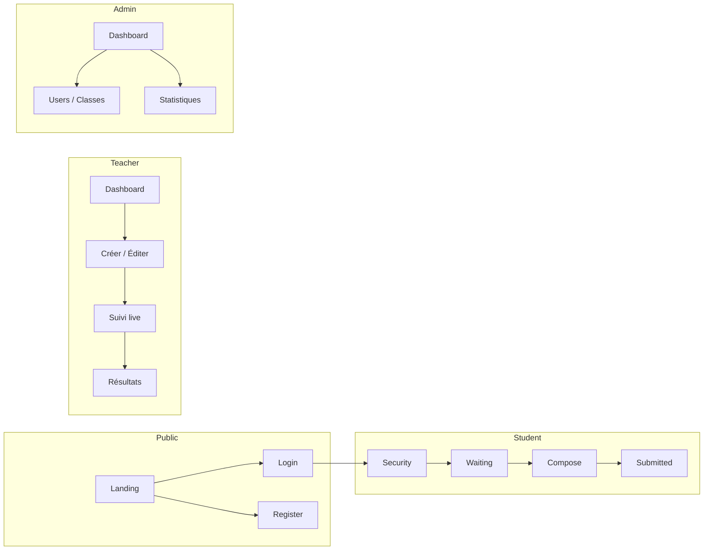

# Cylentic — Architecture du projet

> Plateforme d'examens de programmation sécurisés en navigateur.  
> Stack : **Next.js 16** (App Router) · **Prisma** · **MySQL** · **Redis** · **Docker** (sandbox Python)

---

## Principes directeurs

| Principe | Application |
|----------|-------------|
| **Multi-tenant** | Chaque entité métier est rattachée à un `establishment_id` |
| **Rôle déduit** | Le rôle est inféré du format d'identifiant (`ETU-`, `PROF-`, `ADM-`) |
| **Séparation des couches** | Pages → Composants → Hooks → Services → Repositories → Prisma |
| **Sécurité examen côté client** | Hooks dédiés (`useFullscreen`, `useTabVisibility`, etc.) isolés du reste |
| **Post-MVP explicite** | Dossiers `super-admin/`, `exports/`, `billing/`, `onboarding/`, `api/v1/` marqués Phase 1–3 |

---

## Arborescence

```
cylentic/
├── app/                                    # Next.js App Router
│   ├── (public)/                           # Routes sans authentification
│   │   ├── page.tsx                        # Landing + CTA inscription établissement
│   │   ├── login/page.tsx                  # Connexion (étudiant + code / prof / admin)
│   │   └── register/
│   │       └── establishment/page.tsx      # Création espace établissement + plan
│   │
│   ├── (auth)/                             # Espaces authentifiés par rôle
│   │   ├── student/
│   │   │   ├── change-password/page.tsx
│   │   │   └── exam/
│   │   │       ├── security/page.tsx       # Consignes + plein écran
│   │   │       ├── waiting/page.tsx        # Salle d'attente
│   │   │       ├── compose/page.tsx        # IDE + timer
│   │   │       └── submitted/page.tsx      # Confirmation soumission
│   │   │
│   │   ├── teacher/
│   │   │   ├── layout.tsx
│   │   │   ├── dashboard/page.tsx
│   │   │   └── exams/
│   │   │       ├── page.tsx                # Liste des examens
│   │   │       ├── new/page.tsx            # Création (brouillon)
│   │   │       └── [examId]/
│   │   │           ├── page.tsx            # Détail / édition
│   │   │           ├── edit/page.tsx
│   │   │           ├── live/page.tsx       # Suivi temps réel
│   │   │           ├── presentation/page.tsx  # Code en grand (projecteur)
│   │   │           └── results/
│   │   │               ├── page.tsx        # Liste résultats
│   │   │               └── [participationId]/page.tsx
│   │   │
│   │   ├── admin/
│   │   │   ├── layout.tsx
│   │   │   ├── dashboard/page.tsx
│   │   │   ├── classes/page.tsx
│   │   │   ├── academic-years/page.tsx
│   │   │   ├── students/page.tsx
│   │   │   ├── teachers/page.tsx
│   │   │   ├── admins/page.tsx             # 2e admin max
│   │   │   ├── activity-logs/page.tsx
│   │   │   └── subscription/page.tsx
│   │   │
│   │   └── super-admin/                    # Phase 1 post-MVP
│   │       ├── layout.tsx
│   │       ├── dashboard/page.tsx
│   │       ├── establishments/page.tsx
│   │       ├── plans/page.tsx
│   │       └── feedbacks/page.tsx
│   │
│   ├── api/                                # Route Handlers (backend)
│   │   ├── auth/
│   │   │   ├── login/route.ts
│   │   │   ├── logout/route.ts
│   │   │   ├── change-password/route.ts
│   │   │   └── activate/route.ts           # Phase 1 — token email
│   │   ├── establishments/route.ts
│   │   ├── classes/route.ts
│   │   ├── academic-years/route.ts
│   │   ├── users/
│   │   │   ├── students/route.ts
│   │   │   ├── teachers/route.ts
│   │   │   ├── admins/route.ts
│   │   │   └── import-csv/route.ts
│   │   ├── exams/
│   │   │   ├── route.ts
│   │   │   └── [examId]/
│   │   │       ├── route.ts
│   │   │       ├── publish/route.ts
│   │   │       ├── duplicate/route.ts
│   │   │       ├── exercises/route.ts
│   │   │       ├── live/route.ts
│   │   │       └── results/route.ts
│   │   ├── exam-session/
│   │   │   ├── join/route.ts              # Connexion étudiant + code
│   │   │   ├── autosave/route.ts
│   │   │   ├── execute/route.ts            # Sandbox (run)
│   │   │   ├── submit/route.ts
│   │   │   └── incidents/route.ts
│   │   ├── grading/route.ts
│   │   ├── notifications/route.ts
│   │   ├── exports/                        # Phase 1 — PDF / Excel / CSV
│   │   │   ├── results/route.ts
│   │   │   └── attendance/route.ts
│   │   ├── billing/                        # Phase 2 — abonnements
│   │   │   └── webhook/route.ts
│   │   ├── super-admin/                    # Phase 1
│   │   │   ├── establishments/route.ts
│   │   │   └── plans/route.ts
│   │   └── v1/                             # Phase 3 — API publique (Moodle…)
│   │       └── exams/route.ts
│   │
│   ├── layout.tsx
│   └── globals.css
│
├── components/
│   ├── ui/                                 # Primitives (Button, Input, Card…)
│   ├── layout/                             # Sidebar, Header, DashboardShell
│   ├── auth/                               # Formulaires connexion / inscription
│   ├── student/                            # IDE, timer, QCM, consignes
│   ├── teacher/                            # Création examen, suivi live, résultats
│   ├── admin/                              # Gestion users, classes, CSV
│   ├── super-admin/                        # Phase 1
│   ├── exam/                               # Composants partagés examen
│   └── shared/                             # Logo, modales, tableaux
│
├── lib/
│   ├── prisma.ts                           # Client Prisma singleton
│   ├── redis.ts                            # Client Redis (sessions, timer)
│   ├── auth/                               # JWT, middleware helpers, rôles
│   ├── validators/                         # Schémas Zod par domaine
│   ├── services/                           # Logique métier
│   │   ├── auth.service.ts
│   │   ├── establishment.service.ts
│   │   ├── user.service.ts
│   │   ├── exam.service.ts
│   │   ├── participation.service.ts
│   │   ├── grading.service.ts
│   │   ├── sandbox.service.ts
│   │   ├── security.service.ts
│   │   ├── notification.service.ts
│   │   ├── export.service.ts               # Phase 1
│   │   ├── billing.service.ts              # Phase 2
│   │   └── super-admin.service.ts          # Phase 1
│   ├── repositories/                       # Accès données (Prisma)
│   ├── utils/                              # Identifiants, codes examen, dates
│   ├── constants/                          # Plans, langages, incidents
│   └── types/                              # Types TypeScript partagés
│
├── hooks/
│   ├── use-auth.ts
│   ├── use-exam-timer.ts
│   ├── use-autosave.ts
│   ├── security/                           # Anti-triche navigateur
│   │   ├── use-fullscreen.ts
│   │   ├── use-tab-visibility.ts
│   │   ├── use-clipboard-guard.ts
│   │   └── use-keyboard-lock.ts
│   └── realtime/
│       └── use-exam-live.ts
│
├── workers/                                # Jobs asynchrones (grading, emails)
│   ├── grading.worker.ts
│   └── exam-status.worker.ts
│
├── prisma/
│   ├── schema.prisma                       # Modèle complet (MySQL)
│   ├── migrations/
│   └── seed.ts
│
├── docker/
│   ├── docker-compose.yml                  # App + Postgres + Redis + sandbox
│   ├── sandbox/
│   │   └── Dockerfile                      # Python 3.11.15-alpine
│   └── redis/
│
├── public/
│   └── assets/
│
├── design-template/                        # Maquettes de référence (existant)
├── db.md / db.sql                          # Référence BDD (existant)
└── Cylentic_Reference_Projet_Finale.md     # Spec fonctionnelle (existant)
```

---

## Flux par domaine



---

## Mapping MVP vs Post-MVP

| Zone | MVP | Phase 1 | Phase 2 | Phase 3 |
|------|-----|---------|---------|---------|
| Langages | Python | Java, C, C++ | — | — |
| QCM | Structure BDD + squelette | Complet + options avancées | — | — |
| Super Admin | — | `super-admin/` | — | — |
| Exports | — | PDF / Excel / CSV | — | — |
| Activation email | Mot de passe défaut | Token unique | — | — |
| Facturation | Simulée | — | Stripe / mobile money | — |
| Onboarding | — | — | Guidé | — |
| API publique | — | — | — | `api/v1/` |
| Surveillant numérique | — | — | — | `proctor/` |

---

## Prochaines étapes d'implémentation

1. Schéma Prisma complet aligné sur `db.sql`
2. Authentification JWT + middleware de protection des routes
3. Parcours Admin (inscription établissement, users, classes)
4. Parcours Professeur (CRUD examens, publication, résultats)
5. Parcours Étudiant (sécurité, IDE Monaco, sandbox, soumission)
6. Redis (timer serveur) + workers de correction
7. Fonctionnalités post-MVP par phase
