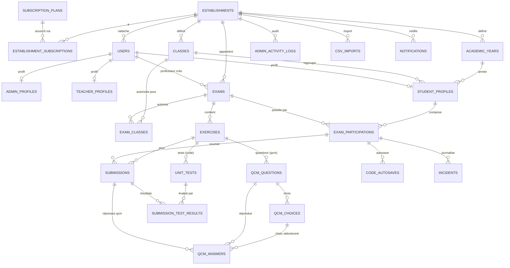

# Cylentic — Modèle de base de données

> SGBD cible : **MySQL 8+**
> Le schéma exécutable est maintenu via **Prisma** ([`prisma/schema.prisma`](./prisma/schema.prisma)) ; `db.sql` est une référence historique.
> Ce document décrit les tables, attributs, relations, cardinalités et choix de conception.

---

## Sommaire

1. [Conventions de conception](#1-conventions-de-conception)
2. [Vue d'ensemble par domaine](#2-vue-densemble-par-domaine)
3. [Diagramme entité-relation (ERD)](#3-diagramme-entité-relation-erd)
4. [Types énumérés](#4-types-énumérés)
5. [Dictionnaire des tables](#5-dictionnaire-des-tables)
6. [Relations et cardinalités](#6-relations-et-cardinalités)
7. [Index et performance](#7-index-et-performance)
8. [Règles d'intégrité et invariants métier](#8-règles-dintégrité-et-invariants-métier)
9. [Stratégie de rétention et d'archivage](#9-stratégie-de-rétention-et-darchivage)

---

## 1. Conventions de conception

| Convention | Choix |
|------------|-------|
| Clés primaires | `UUID` (`CHAR(36)`, généré côté app via Prisma `uuid()`) — opaques, non devinables |
| Nommage | `snake_case`, tables au **pluriel**, colonnes au singulier |
| Horodatage | `created_at` / `updated_at` en `DATETIME(3)` (UTC), `updated_at` géré par Prisma |
| Dates d'examen | `DATETIME(3)` + `timezone` de l'établissement (heure réelle de démarrage) |
| Suppression | **Pas de suppression physique** des comptes : `is_active`/archivage (données historiques conservées) |
| Multi-tenant | `establishment_id` sur chaque entité métier |
| Argent | `DECIMAL` (jamais `float`) ; scores en `DECIMAL(6,2)` |
| Données semi-structurées | `JSON` (rapports d'import, métadonnées d'incidents, audit) |
| Rôle utilisateur | Déduit du **format de l'identifiant**, matérialisé dans `users.role` |

---

## 2. Vue d'ensemble par domaine

| Domaine | Tables |
|---------|--------|
| **Facturation / Tenant** | `subscription_plans`, `establishments`, `establishment_subscriptions` |
| **Référentiel scolaire** | `academic_years`, `classes` |
| **Identité & comptes** | `users`, `admin_profiles`, `teacher_profiles`, `student_profiles` |
| **Conception d'examen** | `exams`, `exam_classes`, `exercises`, `unit_tests`, `qcm_questions`, `qcm_choices` |
| **Passation & copies** | `exam_participations`, `submissions`, `submission_test_results`, `qcm_answers`, `code_autosaves` |
| **Sécurité & anti-triche** | `incidents`, `login_attempts`, `exam_code_attempts` |
| **Exploitation** | `admin_activity_logs`, `csv_imports`, `notifications` |

---

## 3. Diagramme entité-relation (ERD)

---

## 4. Types énumérés

| Type | Valeurs | Usage |
|------|---------|-------|
| `user_role` | `admin`, `teacher`, `student` | Rôle déduit de l'identifiant |
| `establishment_type` | `university_public`, `university_private`, `engineering_school`, `bts`, `technical_highschool`, `other` | Type d'établissement |
| `subscription_status` | `trial`, `active`, `expired`, `cancelled` | État de l'abonnement |
| `exam_status` | `draft`, `published`, `in_progress`, `finished`, `archived` | Cycle de vie de l'examen |
| `correction_mode` | `auto`, `manual` | Mode de correction (examen / exercice) |
| `exercise_type` | `code`, `qcm` | Nature d'un exercice |
| `qcm_answer_type` | `single`, `multiple` | Réponse unique ou multiple |
| `participation_status` | `connected`, `waiting`, `in_progress`, `submitted`, `excluded`, `absent` | Statut d'un étudiant |
| `submission_reason` | `manual`, `timer`, `excluded` | Cause de la soumission |
| `incident_type` | `fullscreen_exit`, `tab_switch`, `session_close`, `network_issue`, `clipboard_paste` | Type d'incident de sécurité |
| `notification_status` | `pending`, `sent`, `failed` | État d'une notification |

---

## 5. Dictionnaire des tables

### 5.1 `subscription_plans` — Catalogue des plans (Freemium)

| Colonne | Type | Contraintes | Description |
|---------|------|-------------|-------------|
| `id` | UUID | PK | |
| `code` | TEXT | UNIQUE, NOT NULL | `free`, `starter`, `pro`, `enterprise` |
| `name` | TEXT | NOT NULL | Libellé affiché |
| `max_teachers` | INT | NULL = illimité | Limite de professeurs |
| `max_students` | INT | NULL = illimité | Limite d'étudiants |
| `max_exams_per_month` | INT | NULL = illimité | Quota mensuel d'examens |
| `price_min` | NUMERIC(12,2) | NULL | Borne basse (FCFA) |
| `price_max` | NUMERIC(12,2) | NULL | Borne haute (FCFA) |
| `currency` | TEXT | DEFAULT `XOF` | Devise |
| `features` | JSONB | DEFAULT `{}` | Fonctionnalités incluses |
| `is_active` | BOOLEAN | DEFAULT true | Plan proposable |
| `created_at` / `updated_at` | TIMESTAMPTZ | | |

### 5.2 `establishments` — Établissements (tenant)

| Colonne | Type | Contraintes | Description |
|---------|------|-------------|-------------|
| `id` | UUID | PK | |
| `name` | TEXT | NOT NULL | Nom officiel |
| `acronym` | TEXT | NOT NULL | Sigle (utilisé dans les identifiants) |
| `type` | establishment_type | NOT NULL | Type d'établissement |
| `country` | TEXT | NOT NULL | Pays |
| `city` | TEXT | NOT NULL | Ville |
| `timezone` | TEXT | NOT NULL | Fuseau horaire (ex. `Africa/Ouagadougou`) — **critique** pour l'heure de début |
| `official_email` | TEXT | NOT NULL | Email officiel |
| `phone` | TEXT | NOT NULL | Téléphone de secours |
| `is_active` | BOOLEAN | DEFAULT true | |
| `created_at` / `updated_at` | TIMESTAMPTZ | | |

### 5.3 `establishment_subscriptions` — Abonnements

| Colonne | Type | Contraintes | Description |
|---------|------|-------------|-------------|
| `id` | UUID | PK | |
| `establishment_id` | UUID | FK → establishments, NOT NULL | |
| `plan_id` | UUID | FK → subscription_plans, NOT NULL | |
| `status` | subscription_status | DEFAULT `trial` | |
| `is_simulated` | BOOLEAN | DEFAULT true | MVP : paiement simulé |
| `trial_ends_at` | TIMESTAMPTZ | NULL | Fin des 30 jours Pro offerts |
| `started_at` | TIMESTAMPTZ | DEFAULT now() | |
| `current_period_end` | TIMESTAMPTZ | NULL | |
| `created_at` / `updated_at` | TIMESTAMPTZ | | |

### 5.4 `academic_years` — Années académiques

| Colonne | Type | Contraintes | Description |
|---------|------|-------------|-------------|
| `id` | UUID | PK | |
| `establishment_id` | UUID | FK → establishments, NOT NULL | |
| `label` | TEXT | NOT NULL | Ex. `2025-2026` |
| `start_date` | DATE | NULL | |
| `end_date` | DATE | NULL | |
| `is_active` | BOOLEAN | DEFAULT false | Année courante |
| `is_archived` | BOOLEAN | DEFAULT false | Consultable, non modifiable |
| `created_at` / `updated_at` | TIMESTAMPTZ | | |
| | | UNIQUE (`establishment_id`, `label`) | |

### 5.5 `classes` — Référentiel des classes / promotions

| Colonne | Type | Contraintes | Description |
|---------|------|-------------|-------------|
| `id` | UUID | PK | |
| `establishment_id` | UUID | FK → establishments, NOT NULL | |
| `name` | TEXT | NOT NULL | Ex. `L2 INFO` |
| `track` | TEXT | NULL | Filière |
| `level` | TEXT | NULL | Niveau |
| `is_archived` | BOOLEAN | DEFAULT false | |
| `created_at` / `updated_at` | TIMESTAMPTZ | | |
| | | UNIQUE (`establishment_id`, `name`) | |

### 5.6 `users` — Comptes (base commune aux 3 rôles)

| Colonne | Type | Contraintes | Description |
|---------|------|-------------|-------------|
| `id` | UUID | PK | |
| `establishment_id` | UUID | FK → establishments, NOT NULL | Tenant |
| `identifier` | TEXT | UNIQUE, NOT NULL | `ETU-…`, `PROF-…`, `ADM-…` |
| `role` | user_role | NOT NULL | Déduit du format de l'identifiant |
| `email` | TEXT | NOT NULL | |
| `first_name` | TEXT | NOT NULL | |
| `last_name` | TEXT | NOT NULL | |
| `password_hash` | TEXT | NOT NULL | argon2/bcrypt |
| `must_change_password` | BOOLEAN | DEFAULT true | Mot de passe par défaut `1234` à personnaliser |
| `is_active` | BOOLEAN | DEFAULT true | Désactivation sans suppression |
| `last_login_at` | TIMESTAMPTZ | NULL | |
| `created_at` / `updated_at` | TIMESTAMPTZ | | |
| | | UNIQUE (`establishment_id`, `email`) | |

### 5.7 `admin_profiles` / `teacher_profiles` / `student_profiles`

**`admin_profiles`** (extension 1–1 de `users`)

| Colonne | Type | Contraintes | Description |
|---------|------|-------------|-------------|
| `user_id` | UUID | PK, FK → users | |
| `function` | TEXT | NULL | Fonction (DSI, Directeur des études…) |

**`teacher_profiles`**

| Colonne | Type | Contraintes | Description |
|---------|------|-------------|-------------|
| `user_id` | UUID | PK, FK → users | |
| `subjects` | TEXT | NULL | Matières enseignées (informatif) |
| `function` | TEXT | NULL | Ex. Maître de conférences |

**`student_profiles`**

| Colonne | Type | Contraintes | Description |
|---------|------|-------------|-------------|
| `user_id` | UUID | PK, FK → users | |
| `matricule` | TEXT | NOT NULL | Matricule / INE |
| `class_id` | UUID | FK → classes, NULL | Classe courante |
| `academic_year_id` | UUID | FK → academic_years, NULL | Année courante |
| | | UNIQUE (`user_id`) ; matricule unique par établissement (via users) | |

### 5.8 `exams` — Examens

| Colonne | Type | Contraintes | Description |
|---------|------|-------------|-------------|
| `id` | UUID | PK | |
| `establishment_id` | UUID | FK → establishments, NOT NULL | |
| `teacher_id` | UUID | FK → users, NOT NULL | Professeur créateur |
| `name` | TEXT | NOT NULL | |
| `status` | exam_status | DEFAULT `draft` | |
| `start_at` | TIMESTAMPTZ | NULL | Démarrage automatique |
| `duration_minutes` | INT | NULL, > 0 | Timer global |
| `access_delay_minutes` | INT | DEFAULT 0 | Validité du code après démarrage (retardataires) |
| `correction_mode` | correction_mode | DEFAULT `auto` | Mode global |
| `access_code` | TEXT | UNIQUE, NULL | Généré à la publication (`XXXX-XXXX`) |
| `max_incidents_before_close` | INT | DEFAULT 2 | Seuil d'expulsion configurable |
| `timezone` | TEXT | NULL | Hérité de l'établissement |
| `published_at` / `started_at` / `ended_at` | TIMESTAMPTZ | NULL | Jalons |
| `created_at` / `updated_at` | TIMESTAMPTZ | | |

### 5.9 `exam_classes` — Classes autorisées (M:N)

| Colonne | Type | Contraintes |
|---------|------|-------------|
| `exam_id` | UUID | FK → exams |
| `class_id` | UUID | FK → classes |
| | | PK (`exam_id`, `class_id`) |

### 5.10 `exercises` — Contenu d'un examen (polymorphe)

| Colonne | Type | Contraintes | Description |
|---------|------|-------------|-------------|
| `id` | UUID | PK | |
| `exam_id` | UUID | FK → exams, NOT NULL | |
| `type` | exercise_type | NOT NULL | `code` ou `qcm` (bloc) |
| `title` | TEXT | NOT NULL | |
| `statement` | TEXT | NULL | Énoncé (texte riche) |
| `language` | TEXT | NULL | Langage (`python` au MVP) — pour les exercices `code` |
| `judge0_language_id` | INT | NULL | Mapping Judge0 (extensible multi-langages) |
| `points` | NUMERIC(6,2) | DEFAULT 0 | Points dans la note finale |
| `correction_mode` | correction_mode | DEFAULT `auto` | Auto / manuel (exercices `code`) |
| `order_index` | INT | DEFAULT 0 | Ordre d'affichage |
| `created_at` / `updated_at` | TIMESTAMPTZ | | |

### 5.11 `unit_tests` — Tests unitaires (exercices `code`)

| Colonne | Type | Contraintes | Description |
|---------|------|-------------|-------------|
| `id` | UUID | PK | |
| `exercise_id` | UUID | FK → exercises, NOT NULL | |
| `input` | TEXT | NULL | Entrée (stdin / appel) |
| `expected_output` | TEXT | NOT NULL | Sortie attendue |
| `weight` | NUMERIC(6,2) | DEFAULT 1 | Pondération du test |
| `is_hidden` | BOOLEAN | DEFAULT false | Masqué à l'étudiant |
| `order_index` | INT | DEFAULT 0 | |
| `created_at` | TIMESTAMPTZ | | |

### 5.12 `qcm_questions` / `qcm_choices` (exercices `qcm`)

**`qcm_questions`**

| Colonne | Type | Contraintes | Description |
|---------|------|-------------|-------------|
| `id` | UUID | PK | |
| `exercise_id` | UUID | FK → exercises, NOT NULL | Bloc QCM |
| `text` | TEXT | NOT NULL | Intitulé |
| `answer_type` | qcm_answer_type | DEFAULT `single` | Unique / multiple |
| `points` | NUMERIC(6,2) | DEFAULT 0 | |
| `explanation` | TEXT | NULL | Explication (post-MVP) |
| `order_index` | INT | DEFAULT 0 | |
| `created_at` / `updated_at` | TIMESTAMPTZ | | |

**`qcm_choices`**

| Colonne | Type | Contraintes | Description |
|---------|------|-------------|-------------|
| `id` | UUID | PK | |
| `question_id` | UUID | FK → qcm_questions, NOT NULL | |
| `text` | TEXT | NOT NULL | |
| `is_correct` | BOOLEAN | DEFAULT false | |
| `order_index` | INT | DEFAULT 0 | |

### 5.13 `exam_participations` — Une copie par (examen, étudiant)

| Colonne | Type | Contraintes | Description |
|---------|------|-------------|-------------|
| `id` | UUID | PK | |
| `exam_id` | UUID | FK → exams, NOT NULL | |
| `student_id` | UUID | FK → users, NOT NULL | |
| `status` | participation_status | DEFAULT `connected` | |
| `is_completed` | BOOLEAN | DEFAULT false | Anti double-soumission |
| `connected_at` | TIMESTAMPTZ | NULL | Présence numérique |
| `ip_address` | INET | NULL | IP de connexion |
| `waiting_room_entered_at` | TIMESTAMPTZ | NULL | |
| `started_at` | TIMESTAMPTZ | NULL | Entrée en composition |
| `submitted_at` | TIMESTAMPTZ | NULL | |
| `submission_reason` | submission_reason | NULL | manual / timer / excluded |
| `auto_score` | NUMERIC(6,2) | NULL | Score automatique total |
| `manual_score` | NUMERIC(6,2) | NULL | Ajustement manuel |
| `final_score` | NUMERIC(6,2) | NULL | Note finale |
| `created_at` / `updated_at` | TIMESTAMPTZ | | |
| | | UNIQUE (`exam_id`, `student_id`) | |

### 5.14 `submissions` — Copie par exercice

| Colonne | Type | Contraintes | Description |
|---------|------|-------------|-------------|
| `id` | UUID | PK | |
| `participation_id` | UUID | FK → exam_participations, NOT NULL | |
| `exercise_id` | UUID | FK → exercises, NOT NULL | |
| `source_code` | TEXT | NULL | Code soumis (exercices `code`) |
| `language` | TEXT | NULL | |
| `auto_score` | NUMERIC(6,2) | NULL | % de tests passés × points |
| `manual_score` | NUMERIC(6,2) | NULL | |
| `final_score` | NUMERIC(6,2) | NULL | |
| `comment` | TEXT | NULL | Commentaire du prof |
| `submitted_at` | TIMESTAMPTZ | NULL | |
| `created_at` / `updated_at` | TIMESTAMPTZ | | |
| | | UNIQUE (`participation_id`, `exercise_id`) | |

### 5.15 `submission_test_results` — Résultat par test unitaire

| Colonne | Type | Contraintes | Description |
|---------|------|-------------|-------------|
| `id` | UUID | PK | |
| `submission_id` | UUID | FK → submissions, NOT NULL | |
| `unit_test_id` | UUID | FK → unit_tests, NOT NULL | |
| `passed` | BOOLEAN | NOT NULL | |
| `actual_output` | TEXT | NULL | Sortie obtenue |
| `stderr` | TEXT | NULL | Erreurs |
| `status` | TEXT | NULL | Statut Judge0 (Accepted, TLE…) |
| `time_ms` | INT | NULL | Temps d'exécution |
| `memory_kb` | INT | NULL | Mémoire utilisée |
| `executed_at` | TIMESTAMPTZ | DEFAULT now() | |

### 5.16 `qcm_answers` — Réponses QCM sélectionnées

| Colonne | Type | Contraintes | Description |
|---------|------|-------------|-------------|
| `id` | UUID | PK | |
| `submission_id` | UUID | FK → submissions, NOT NULL | |
| `question_id` | UUID | FK → qcm_questions, NOT NULL | |
| `choice_id` | UUID | FK → qcm_choices, NOT NULL | Choix sélectionné |
| `created_at` | TIMESTAMPTZ | DEFAULT now() | |
| | | UNIQUE (`submission_id`, `question_id`, `choice_id`) | |

### 5.17 `code_autosaves` — Sauvegarde automatique (30 s)

| Colonne | Type | Contraintes | Description |
|---------|------|-------------|-------------|
| `id` | UUID | PK | |
| `participation_id` | UUID | FK → exam_participations, NOT NULL | |
| `exercise_id` | UUID | FK → exercises, NOT NULL | |
| `content` | TEXT | NULL | Dernier état du code |
| `saved_at` | TIMESTAMPTZ | DEFAULT now() | |
| | | UNIQUE (`participation_id`, `exercise_id`) — dernier état | |

### 5.18 `incidents` — Journal d'incidents de sécurité

| Colonne | Type | Contraintes | Description |
|---------|------|-------------|-------------|
| `id` | UUID | PK | |
| `participation_id` | UUID | FK → exam_participations, NOT NULL | |
| `type` | incident_type | NOT NULL | |
| `occurred_at` | TIMESTAMPTZ | DEFAULT now() | Heure exacte |
| `duration_seconds` | INT | NULL | Durée (ex. hors plein écran) |
| `payload` | TEXT | NULL | Contenu collé (clipboard) |
| `metadata` | JSONB | DEFAULT `{}` | Détails additionnels |
| `created_at` | TIMESTAMPTZ | DEFAULT now() | |

### 5.19 `login_attempts` — Anti-brute-force connexion

| Colonne | Type | Contraintes | Description |
|---------|------|-------------|-------------|
| `id` | UUID | PK | |
| `identifier` | TEXT | NOT NULL | Identifiant saisi |
| `establishment_id` | UUID | FK → establishments, NULL | |
| `ip_address` | INET | NULL | |
| `success` | BOOLEAN | NOT NULL | |
| `attempted_at` | TIMESTAMPTZ | DEFAULT now() | |

### 5.20 `exam_code_attempts` — Tentatives de code d'examen (max 5)

| Colonne | Type | Contraintes | Description |
|---------|------|-------------|-------------|
| `id` | UUID | PK | |
| `exam_id` | UUID | FK → exams, NULL | |
| `identifier` | TEXT | NULL | Étudiant |
| `ip_address` | INET | NULL | |
| `success` | BOOLEAN | NOT NULL | |
| `attempted_at` | TIMESTAMPTZ | DEFAULT now() | |

### 5.21 `admin_activity_logs` — Journal d'activité admin

| Colonne | Type | Contraintes | Description |
|---------|------|-------------|-------------|
| `id` | UUID | PK | |
| `establishment_id` | UUID | FK → establishments, NOT NULL | |
| `actor_user_id` | UUID | FK → users, NULL | Admin auteur |
| `action` | TEXT | NOT NULL | Ex. `user.create`, `csv.import`, `plan.change` |
| `entity_type` | TEXT | NULL | Type d'entité visée |
| `entity_id` | UUID | NULL | |
| `old_value` | JSONB | NULL | Ancienne valeur |
| `new_value` | JSONB | NULL | Nouvelle valeur |
| `ip_address` | INET | NULL | |
| `created_at` | TIMESTAMPTZ | DEFAULT now() | |

### 5.22 `csv_imports` — Imports d'étudiants

| Colonne | Type | Contraintes | Description |
|---------|------|-------------|-------------|
| `id` | UUID | PK | |
| `establishment_id` | UUID | FK → establishments, NOT NULL | |
| `actor_user_id` | UUID | FK → users, NULL | |
| `filename` | TEXT | NULL | |
| `total_rows` | INT | DEFAULT 0 | |
| `imported_count` | INT | DEFAULT 0 | |
| `rejected_count` | INT | DEFAULT 0 | |
| `error_report` | JSONB | DEFAULT `[]` | Lignes rejetées + motifs |
| `created_at` | TIMESTAMPTZ | DEFAULT now() | |

### 5.23 `notifications` — Notifications / emails critiques

| Colonne | Type | Contraintes | Description |
|---------|------|-------------|-------------|
| `id` | UUID | PK | |
| `establishment_id` | UUID | FK → establishments, NULL | |
| `recipient_user_id` | UUID | FK → users, NULL | |
| `recipient_email` | TEXT | NULL | |
| `type` | TEXT | NOT NULL | Ex. `plan.limit_80`, `bruteforce.detected` |
| `channel` | TEXT | DEFAULT `email` | |
| `subject` | TEXT | NULL | |
| `body` | TEXT | NULL | |
| `status` | notification_status | DEFAULT `pending` | |
| `sent_at` | TIMESTAMPTZ | NULL | |
| `created_at` | TIMESTAMPTZ | DEFAULT now() | |

---

## 6. Relations et cardinalités

| Relation | Cardinalité | Règle de suppression |
|----------|-------------|----------------------|
| establishments → establishment_subscriptions | 1 — N | CASCADE |
| subscription_plans → establishment_subscriptions | 1 — N | RESTRICT (plan protégé) |
| establishments → academic_years / classes / users | 1 — N | CASCADE |
| users → admin/teacher/student_profiles | 1 — 0..1 | CASCADE |
| classes → student_profiles | 1 — N | SET NULL |
| academic_years → student_profiles | 1 — N | SET NULL |
| users (prof) → exams | 1 — N | RESTRICT (historique conservé) |
| exams ↔ classes | N — M (`exam_classes`) | CASCADE |
| exams → exercises | 1 — N | CASCADE |
| exercises → unit_tests | 1 — N | CASCADE |
| exercises → qcm_questions → qcm_choices | 1 — N — N | CASCADE |
| exams → exam_participations | 1 — N | CASCADE |
| users (étudiant) → exam_participations | 1 — N | RESTRICT |
| exam_participations → submissions | 1 — N | CASCADE |
| exercises → submissions | 1 — N | RESTRICT |
| submissions → submission_test_results | 1 — N | CASCADE |
| unit_tests → submission_test_results | 1 — N | RESTRICT |
| submissions → qcm_answers | 1 — N | CASCADE |
| exam_participations → incidents / code_autosaves | 1 — N | CASCADE |

> **Unicités structurantes :**
> `users.identifier` (global), `exams.access_code` (global), `exam_participations(exam_id, student_id)`,
> `submissions(participation_id, exercise_id)`, `code_autosaves(participation_id, exercise_id)`.

---

## 7. Index et performance

| Table | Index | Justification |
|-------|-------|---------------|
| `users` | `(establishment_id)`, `lower(identifier)`, `(role)` | Connexion, filtrage par tenant/rôle |
| `exams` | `(establishment_id)`, `(teacher_id)`, `(status)`, `(access_code)` | Tableau de bord prof, accès par code |
| `exam_participations` | `(exam_id)`, `(student_id)`, `(status)` | Suivi live, anti double-soumission |
| `submissions` | `(participation_id)`, `(exercise_id)` | Vue de correction |
| `incidents` | `(participation_id, occurred_at)` | Chronologie du rapport |
| `login_attempts` | `(identifier, attempted_at)`, `(ip_address, attempted_at)` | Détection brute-force |
| `exam_code_attempts` | `(exam_id, identifier, attempted_at)` | Limite des 5 tentatives |
| `admin_activity_logs` | `(establishment_id, created_at)` | Journal d'audit |
| `student_profiles` | `(class_id)`, `(academic_year_id)` | Filtres et promotion en masse |

---

## 8. Règles d'intégrité et invariants métier

1. **Rôle ⇄ identifiant** : `users.role` est cohérent avec le préfixe de `identifier` (`ETU-` → student, `PROF-` → teacher, `ADM-` → admin). Validé applicativement à la création.
2. **Max 2 admins par établissement** : invariant applicatif (compte des `users` de rôle `admin` actifs).
3. **Code d'examen** : généré uniquement à la publication (`status = published`) ; `NULL` en brouillon ; format `XXXX-XXXX` sans caractères ambigus ; unique global.
4. **Verrouillage après démarrage** : dès `status = in_progress`, l'examen et son contenu (énoncé, tests, durée) ne sont plus modifiables (garde applicative).
5. **Une seule copie active** : `exam_participations(exam_id, student_id)` unique ; reconnexion bloquée si `is_completed = true`.
6. **Cohérence type d'exercice** : `unit_tests` → exercices `code` ; `qcm_questions` → exercices `qcm` (garde applicative + contraintes par défaut).
7. **Scores** : `auto_score` calculé par la plateforme ; `final_score` = `manual_score` si présent, sinon `auto_score` ; jamais exposé automatiquement à l'étudiant.
8. **Pas de suppression de comptes** : désactivation (`is_active = false`) uniquement ; toutes les données historiques restent consultables.

---

## 9. Stratégie de rétention et d'archivage

- **Historique d'examens conservé indéfiniment** → duplication d'un examen d'une année précédente possible.
- **Années académiques archivées** (`is_archived = true`) : lecture seule, statistiques et incidents toujours consultables.
- **Comptes désactivés** : conservés, jamais purgés.
- **Logs techniques** (`login_attempts`, `exam_code_attempts`) : candidats à une purge périodique (rétention glissante, ex. 90 jours) sans impact métier.
